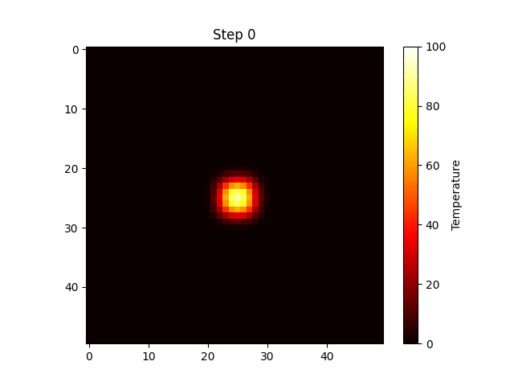

# 2D (and 3D) Heat Diffusion Simulation

A numerical simulation of the heat equation ∂T/∂t = α∇²T using an explicit finite-difference method:
the Laplacian is approximated with a 5-point stencil (7-point in 3D) over each cell's immediate
neighbors, and temperature is advanced step by step with explicit Euler updates.

## Contents


- A 50×50 grid with a hot square diffusing outward under fixed-temperature (Dirichlet) boundaries
- An animated GIF of the diffusion process
- A constant-temperature wall as an alternative initial condition
- An empirical demonstration of the **CFL stability limit**: violating the theoretical bound
  (α·Δt ≤ 0.25 in 2D) causes the simulation to diverge into an unphysical checkerboard pattern within
  20 steps; respecting it keeps the simulation stable over 2000 steps
- The same scheme extended to 3D, visualized as both a 2D slice and a 3D scatter plot

## Getting started

```bash
pip install -r requirements.txt
jupyter notebook heat_diffusion_simulation.ipynb
```

No external data — every grid is generated in the notebook itself. The animation cell takes roughly
30 seconds to render and saves `heat_diffusion.gif` to the working directory.

## Notes

- The boundary condition markdown originally said edges were "fixed" or possibly "mirrors of their
  neighbors" — but the code only ever implements the former: edge cells are never updated by
  `diffusion_step`, so they stay fixed at their initial value (0, except in the heated-wall example).
  Clarified this in the text rather than leaving both described as options.
- One plot title referenced a stale `num_steps` variable (200, left over from an earlier cell) instead
  of the 20 steps actually used in that specific CFL-violation test — fixed to reference the correct
  step count.
